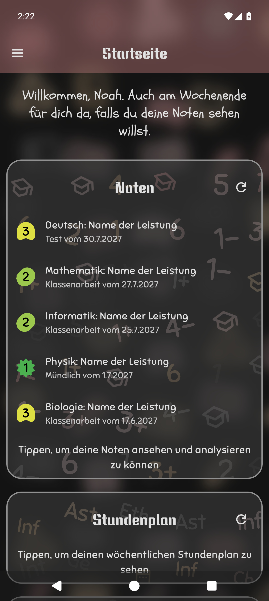
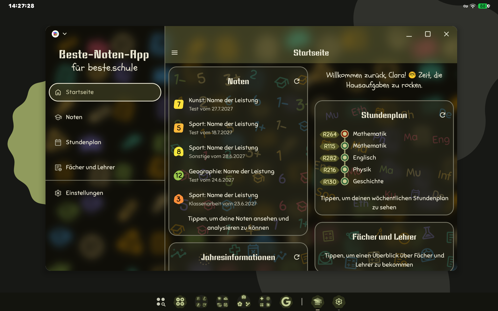
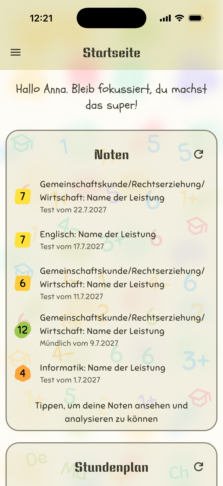
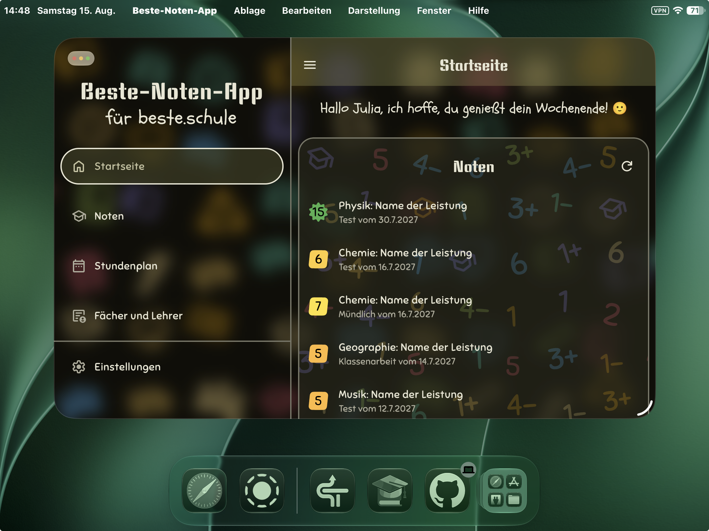
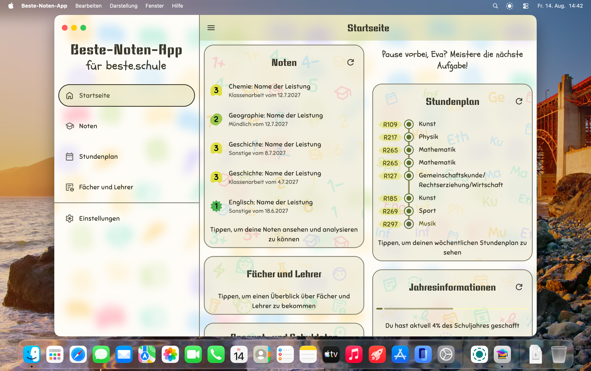
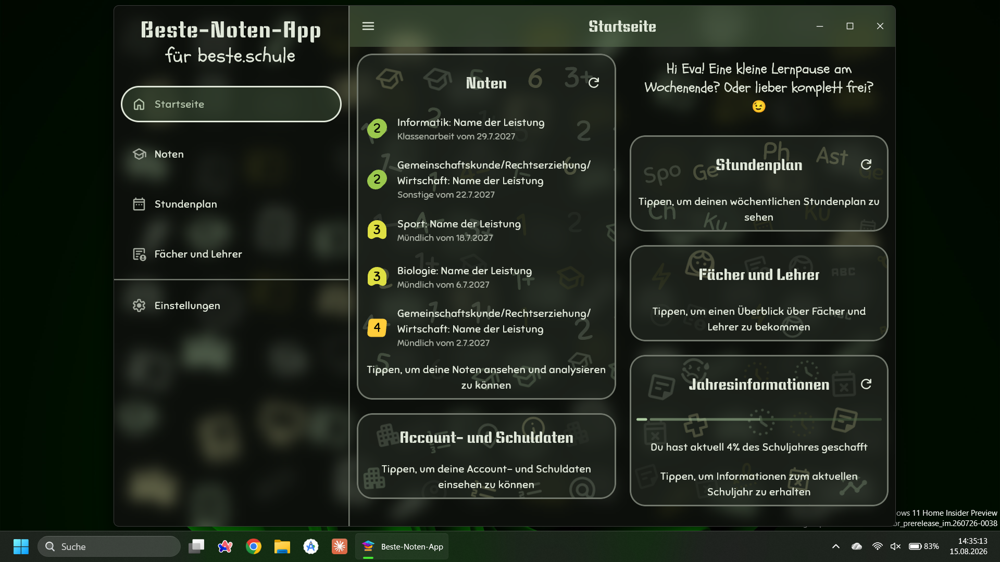
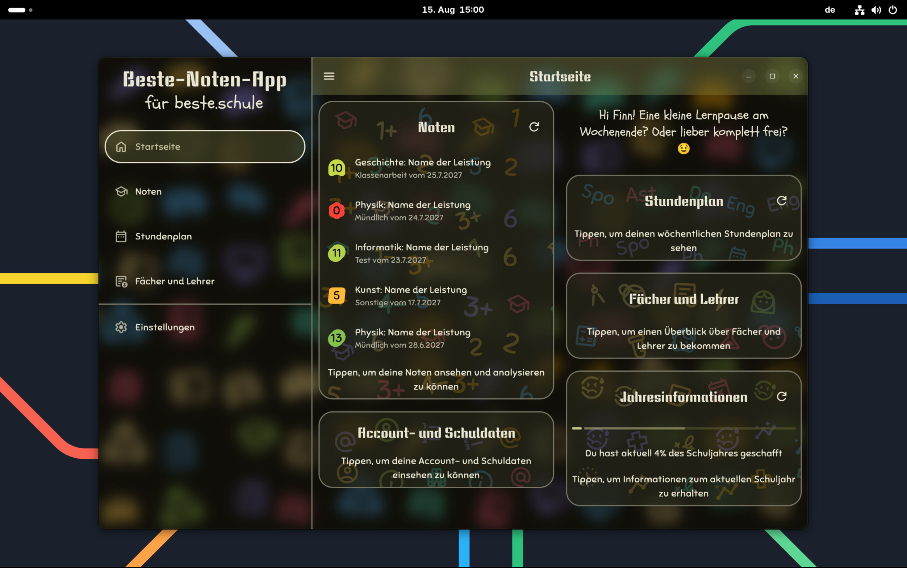
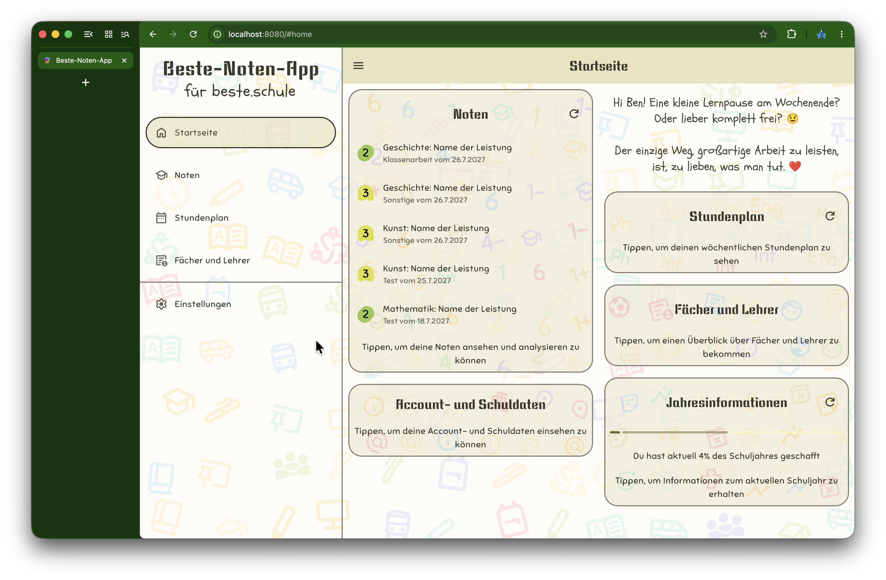

Deutsch | [English](README_en.md)
___

  
  <h1>Beste-Noten-App</h1>

Diese plattformübergreifende Schul-App macht den Schulalltag übersichtlicher und ist eine einfachere, schönere und schnellere Alternative zur offiziellen beste.schule-App.

### [Zur Web-Version](https://hansholz09.github.io/Beste-Noten-App)

**Native Apps:** [siehe Releases](https://github.com/HansHolz09/Beste-Noten-App/releases)
> [!IMPORTANT]  
> Die für iOS/iPadOS bereitgestellte IPA-Datei ist nicht signiert und kann daher nicht direkt auf diesen Geräten installiert werden.
> Es wird daher empfohlen, diese Datei mithilfe von SideStore zu sideloaden ([Einrichtung](https://docs.sidestore.io/docs/installation/prerequisites)).
> Alternativ kann die App auch direkt kompiliert ([siehe **Bauen der App**](#bauenstarten-der-app)) und anschließend über XCode auf dem gewünschten Gerät installiert werden.

## Funktionen
- Login über Private-Access-Token oder direkt über beste.schule
- Demo-Account zum Ausprobieren der App
- Startseite mit Tagesübersicht, aktuellen Noten und dem Jahresfortschritt
- Einfache Notenübersicht mit Möglichkeit zum Ansehen der Noten-Historien und konfigurierbarer Durchschnittsberechnung
- Noten-Diagramme zum Vergleich der verschiedenen Schuljahre
- Übersichtliche Stundenplan-Ansicht mit Vertretungsplan-Änderungen, Abwesenheits-Einträgen und aktuellen Tagesnotizen
- Alternative Blockansicht für den Stundenplan (in Sek. 2 automatisch aktiv) mit automatischer Ausfilterung unnötiger Stunden
- Digitales Hausaufgabenheft inklusive Google-Kalender-Synchronisierung
- Übersicht aktueller Fächer und Lehrer mit ihren Abkürzungen
- Jahresinformationen zu den Halbjahres-Zeiträumen und Abwesenheits-Statistiken inklusive Heatmap zur Anwesenheit nach Stunden
- Dialoge zum Einsehen der Unterrichtszeiten sowie Account- und Schuldaten
- Direkte Unterstützung zum Wechsel des Schuljahres
- Import/Export von App-Einstellungen und Noten-Gewichtungen sowie der Noten mit Möglichkeit zur späteren Ansicht ohne beste.schule-Account
- Vollständiger Offline-Modus dank Caching
- Adaptives Material-3-Expressive-Design auf allen Plattformen mit dynamisch generierten Hintergrundbildern
- Schöne Animationen und Übergänge
- Immersives haptisches Feedback auf unterstützten Geräten
- Benachrichtigungen über neue Noten mit anpassbarem Überprüfungsintervall für Android und iOS
- Optionale biometrische Authentifizierung bei jedem Start der App auf Android, iOS und unterstützten Desktop-Geräten
- Native Desktop-Apps (u. a. über GraalVM) mit plattformspezifischem Rechtsklickmenü
- Einige Anpassungsmöglichkeiten
- und mehr...

## Plattformen/Screenshots

    
Android

    
    

    
iOS/iPadOS

    
    

    
macOS

    

    
Windows

    

    
Linux

    

    
Web

    

## Genutzte Bibliotheken und Plugins
- [Ktor Client](https://github.com/ktorio/ktor) - Apache 2.0 - Zugriff auf Api von beste.schule
- [Kotlin Multiplatform OIDC](https://github.com/kalinjul/kotlin-multiplatform-oidc) - Apache 2.0 - OpenID Connect Unterstützung für Authentifizierung über beste.schule
- [KSafe](https://github.com/ioannisa/KSafe) - Apache 2.0 - Speichern von Einstellungen und Anmeldedaten
- [KoalaPlot Core](https://github.com/koalaplot/koalaplot-core) - MIT - Diagramm-Bibliothek
- [Jetlime](https://github.com/pushpalroy/Jetlime) - MIT - Timeline-Komponenten für Schulstunden-Übersicht
- [Haze](https://github.com/chrisbanes/haze) - Apache 2.0 - Hintergrund Unschärfe-Effekte
- [MaterialKolor](https://github.com/jordond/MaterialKolor) - MIT - Animierte Farb-Übergänge
- [Multiplatform Material You](https://github.com/zacharee/MultiplatformMaterialYou) - MIT - Erstellen von Material-Design-Farbpaletten für JVM
- [Platform-Tools](https://github.com/kdroidFilter/Platform-Tools) - MIT - Reaktives Erkennen von Hell/Dunkel-Modus
- [animate-compose](https://github.com/NomanR/animate-compose) - Apache 2.0 - Animations-Komponenten
- [ConfettiKit](https://github.com/vinceglb/confettikit) - MIT - Confetti-Animationen (Easter-Eggs)
- [Emoji.kt](https://github.com/kosi-libs/Emoji.kt) - Unterstützung für animierte Emojis
- [Compose Sonner](https://github.com/dokar3/compose-sonner) - Apache 2.0 - Toast-Komponente
- [AboutLibraries](https://github.com/mikepenz/AboutLibraries) - Apache 2.0 - Komponente zum Anzeigen der genutzten Bibliotheken
- [multiplatform-markdown-renderer](https://github.com/mikepenz/multiplatform-markdown-renderer) - Apache 2.0 - Anzeigen von Markdown-Texten für In-App-Updater
- [Capturable](https://github.com/jmseb3/Capturable) - MIT - Teilen/Speichern von Composables als Bild
- [FileKit](https://github.com/vinceglb/FileKit) - MIT - Datei-Dialoge für Import/Export
- [Alarmee](https://github.com/Tweener/alarmee) - Apache 2.0 - Benachrichtigungen für Android und iOS
- [KMM Permission](https://github.com/reyazoct/Kmm-Permissions) - MIT - Anfragen der Benachrichtigungsberechtigung
- [multihaptic](https://github.com/xfqwdsj/multihaptic) - MIT - Vielseitig anpassbares haptisches Feedback
- [Advanced MenuBar for Compose Desktop](https://github.com/HansHolz09/Advanced-MenuBar) - Apache 2.0 - Deutsche macOS Menubar mit mehr Optionen
- [Nucleus](https://github.com/kdroidFilter/Nucleus) - MIT - Erzeugen optimierter Tao-Fenster und App-Installer für die Desktop-Ziele
- [Oracle GraalVM](https://www.oracle.com/de/developer/graalvm-developers/) - [GFTC](https://www.oracle.com/downloads/licenses/graal-free-license.html) - Kompilieren der Desktop Apps in nativen Code
- [Ktlint Gradle](https://github.com/JLLeitschuh/ktlint-gradle) - MIT - Wrapper-Plugin für [ktlint](https://github.com/pinterest/ktlint)
- [gradle-buildconfig-plugin](https://github.com/gmazzo/gradle-buildconfig-plugin) - Apache 2.0 - Automatisches Erzeugen von BuildConfig-Klasse für App-Version

## Bauen/Starten der App

1. Klone den Quellcode
2. Öffne ihn mit [Android Studio](https://developer.android.com/studio) oder [Intellij IDEA](https://www.jetbrains.com/idea/download)
3. Zum bauen bzw. starten der iOS/iPadOS App öffne `/iosApp` in XCode (Nur unter macOS)
4. Starte eine beliebige Konfiguration in Android Studio/Intellij IDEA:
    - Run Desktop App / `./gradlew run`
    - Run Web App / `./gradlew wasmJsBrowserDevelopmentRun`
    - Run Android App
    - Package Release as DMG / `./gradlew packageReleaseDmg` / `./gradlew packageGraalvmDmg` (Nur unter macOS)
    - Package Release as EXE / `./gradlew packageReleaseNsis` / `./gradlew packageGraalvmNsis` (Nur unter Windows)
    - Package Release as DEB / `./gradlew packageReleaseDeb` / `./gradlew packageGraalvmDeb` (Nur unter Linux)
    - Package Web App / `./gradlew wasmJsBrowserDistribution`
