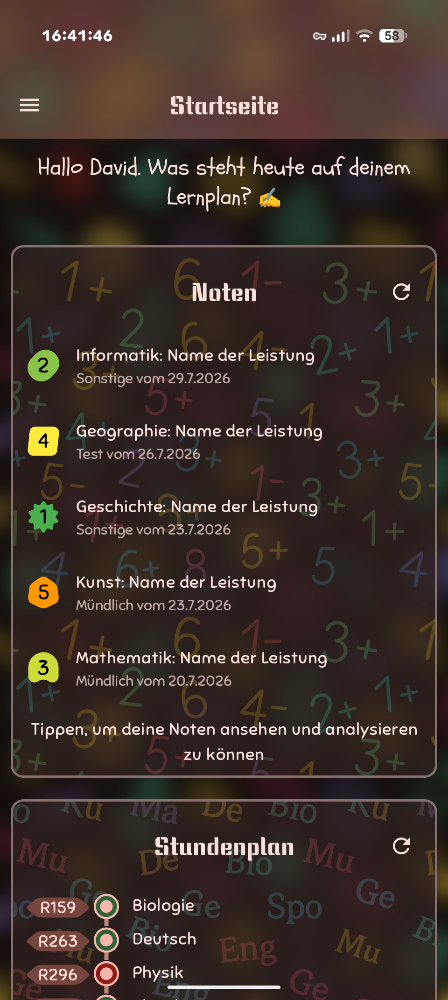
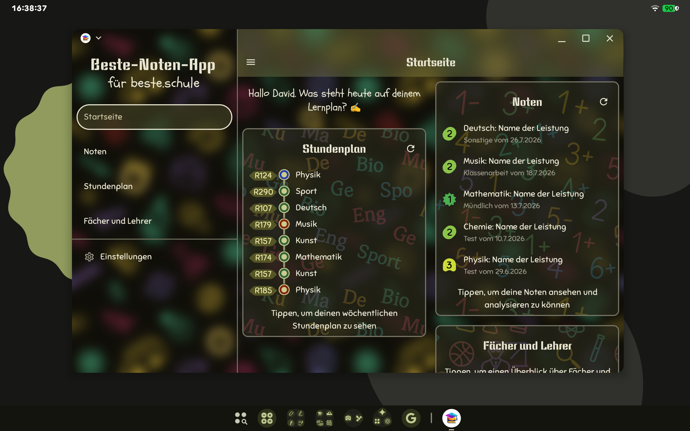
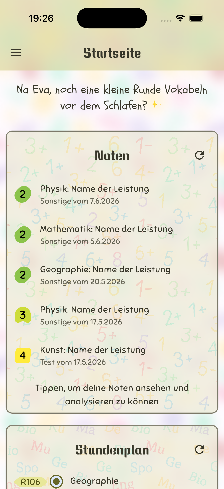
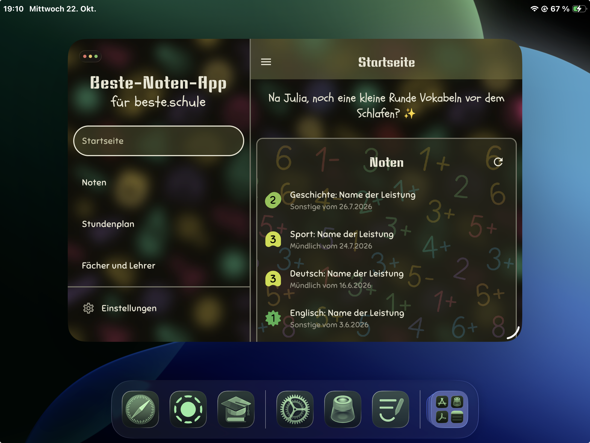
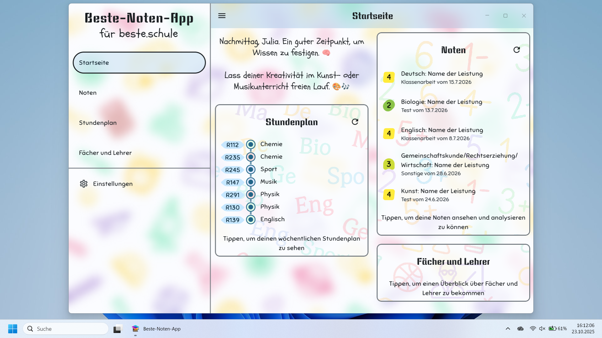
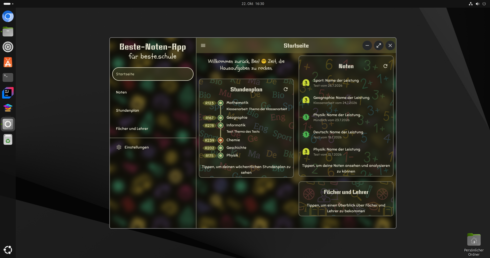
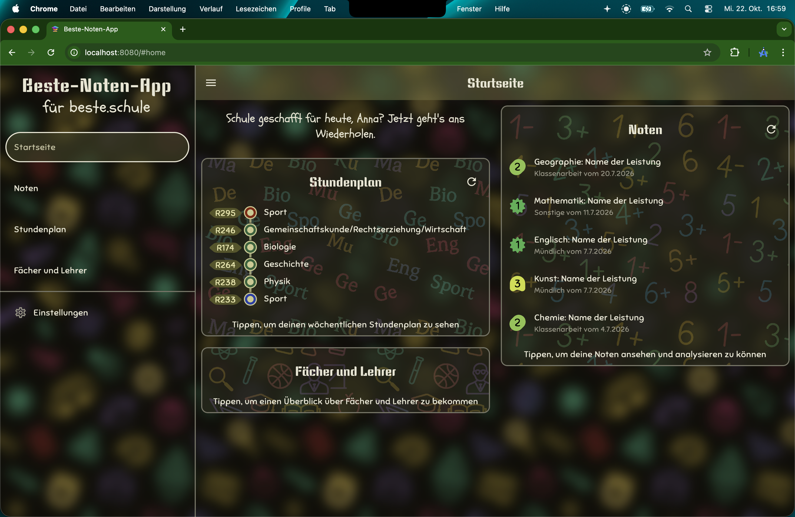

English | [Deutsch](README.md)
___

  
  <h1>Beste-Noten-App</h1>

> **_Background:_** This app was created as part of the practical component of my specialized paper on Compose Multiplatform.

This cross-platform school app makes everyday school life more organized and is a simpler, more beautiful, and faster alternative to the official beste.schule app.

### [Web Version](https://hansholz09.github.io/Beste-Noten-App)

**Native Apps:** [see Releases](https://github.com/HansHolz09/Beste-Noten-App/releases) _(except for iOS)_
> **_Note:_** The native apps are not signed with developer certificates, so you will likely see warnings during installation.
> The iOS/iPadOS version needs to be compiled and installed manually ([see **Building/Running the App**](#buildingrunning-the-app)), as there is currently no way to sideload apps on these devices without an Apple Developer Account.

## Features
- Login via private access token or directly through beste.schule
- Demo account to try out the app
- Home screen with a daily overview and recent grades
- Simple grade overview with the option to view grade histories
- Grade charts to compare different school years
- Clear timetable view with substitution plan changes and absence entries
- Overview of current subjects and teachers with their abbreviations
- Annual information on half-year periods and absence statistics
- Adaptive Material 3 Expressive design on all platforms
- Beautiful animations and transitions
- Immersive haptic feedback on supported devices
- Notifications for new grades with a customizable check interval for Android and iOS
- Optional biometric authentication on every app launch for Android and iOS
- Some customization options
- Integration of native window controls (except on Linux)
- [Smartspacer](https://github.com/KieronQuinn/Smartspacer) integration for Android
- and more...

## Platforms/Screenshots

    
Android

    
    

    
iOS/iPadOS

    
    

    
macOS

    

    
Windows

    

    
Linux

    

    
Web

    

[More Screenshots](SCREENSHOTS.md)

## Libraries and Plugins Used
- [Ktor Client](https://github.com/ktorio/ktor) - Apache 2.0 - Access to the beste.schule API
- [Kotlin Multiplatform OIDC](https://github.com/kalinjul/kotlin-multiplatform-oidc) - Apache 2.0 - OpenID Connect support for authentication via beste.schule
- [Multiplatform Settings](https://github.com/russhwolf/multiplatform-settings) - Apache 2.0 - Saving settings
- [KoalaPlot Core](https://github.com/koalaplot/koalaplot-core) - MIT - Chart library
- [Jetlime](https://github.com/pushpalroy/Jetlime) - MIT - Timeline components for class overview
- [Haze](https://github.com/chrisbanes/haze) - Apache 2.0 - Background blur effects
- [MaterialKolor](https://github.com/jordond/MaterialKolor) - MIT - Animated color transitions
- [Multiplatform Material You](https://github.com/zacharee/MultiplatformMaterialYou) - MIT - Creating Material Design color palettes for JVM
- [Platform-Tools](https://github.com/kdroidFilter/Platform-Tools) - MIT - Reactive detection of light/dark mode
- [animate-compose](https://github.com/NomanR/animate-compose) - Apache 2.0 - Animation components
- [ConfettiKit](https://github.com/vinceglb/confettikit) - MIT - Confetti animations (Easter eggs)
- [Emoji.kt](https://github.com/kosi-libs/Emoji.kt) - Support for animated emojis
- [Compose Sonner](https://github.com/dokar3/compose-sonner) - Apache 2.0 - Toast component
- [Capturable](https://github.com/jmseb3/Capturable) - MIT - Share/save Composables as images
- [Alarmee](https://github.com/Tweener/alarmee) - Apache 2.0 - Notifications for Android and iOS
- [KMM Permission](https://github.com/reyazoct/Kmm-Permissions) - MIT - Requesting notification permissions
- [multihaptic](https://github.com/xfqwdsj/multihaptic) - MIT - Highly customizable haptic feedback
- [AndroidX Security Crypto](https://developer.android.com/jetpack/androidx/releases/security) - Apache 2.0 - Cryptography library for Android
- [AndroidX Biometric](https://developer.android.com/jetpack/androidx/releases/biometric) - Apache 2.0 - Support for biometric authentication on Android
- [SmartSpacer SDK](https://github.com/KieronQuinn/Smartspacer) - GPL 3.0 - Integration for SmartSpacer on Android
- [Advanced Menubar for Compose Desktop](https://github.com/HansHolz09/Advanced-Menubar) - Apache 2.0 - German macOS menubar with more options
- [JBR API](https://github.com/JetBrains/JetBrainsRuntimeApi) - Apache 2.0 - API from JetBrains Runtime for accessing native window controls
- [JNA](https://github.com/java-native-access/jna) - Apache 2.0 - Java Native Access for accessing native window controls
- [Credential Secure Storage for Java](https://github.com/microsoft/credential-secure-storage-for-java) - MIT - Secure token storage for JVM
- [Ktlint Gradle](https://github.com/JLLeitschuh/ktlint-gradle) - MIT - Wrapper plugin for [ktlint](https://github.com/pinterest/ktlint)
- [gradle-buildconfig-plugin](https://github.com/gmazzo/gradle-buildconfig-plugin) - Apache 2.0 - Automatic generation of BuildConfig class for app version

## Building/Running the App

1. Clone the source code
2. Open it with [Android Studio](https://developer.android.com/studio) or [IntelliJ IDEA (Community Edition)](https://www.jetbrains.com/idea/download)
3. To build or run the iOS/iPadOS app, open `/iosApp` in Xcode (macOS only)
4. Run any of the following configurations in Android Studio/IntelliJ IDEA:
    - Run Desktop App / `./gradlew run`
    - Run Web App / `./gradlew wasmJsBrowserDevelopmentRun`
    - Run Android App
    - Package Release as DMG / `./gradlew createReleaseDmg` (macOS only)
    - Package Release as EXE / `./gradlew packageReleaseExe` (Windows only)
    - Package Release as DEB / `./gradlew packageReleaseDeb` (Linux only)
    - Package Web App / `./gradlew wasmJsBrowserDistribution`
